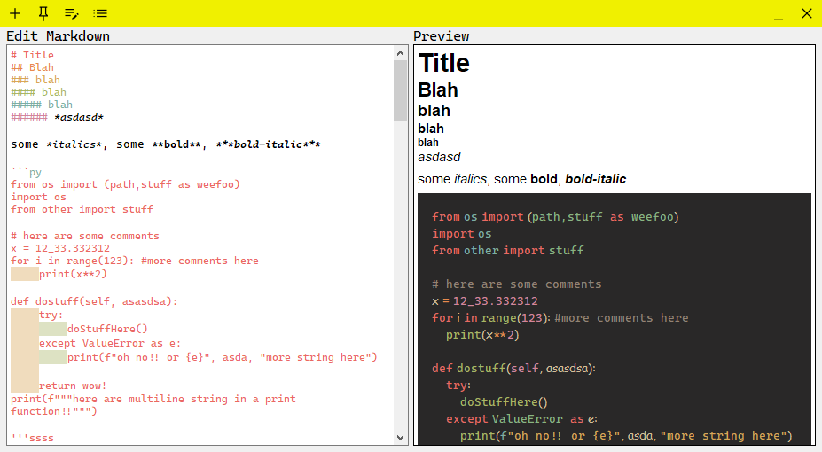

# stickyMarkdown

 
This project was meant to be a sticky notes app that is similar to Windows's built in notes app, except it takes markdown input. 

## Features
* Pin sticky notes on top, so that it shows in front of other windows.
* Live markdown editing and previews.
* Full syntax highlighting in markdown preview, including text coloring, formatting(such as bolder, italics), indent coloring.
* Many convient hotkey supports, such as `Ctrl+*` to wrap text in stars, `Ctrl+B` to bold (double stars), `Ctrl+/` to comment etc. Code involved for hotkeys is easily extendable to support other actions.
* Code block syntax highlighting in preview. Currently there is a simple parser for python and javascript to do basic syntax lighting in preview. The code is setup to support other syntax via plugins (and a lot of regex). 
* Image pasting. When pasting an image into editor, it will be saved to a local cache and be pasted into the editor as: `[imgName/id](path_to_img)`
* Hyperlinks, supports using normal markdown syntax, reference other parts of the document, and opening the default browser for external links.
* *and much more!*


## Discontinuation 
I spent quite some time into this project but eventually decided it is not worth the time, for the following reasons:
1. Qt's bad support for markdown rendering. Currently Qt supports markdown with it's `TextEdit.setMarkdown`, however it only supports replacing the entire document at once, and also renders the markdown via rich text, so that results are rather ugly and doesn't support some markdown features.
    * Another option was to use Qt's website to render markdown, but the website takes too much memory (~100mbs) to just render a simple markdown doc, when most of the webview's feature would not be used.
2. Bad performance. 
    * Since Qt replaces the entire markdown document in order to update, this takes time to take effect.
    * Qt's support for markdown is not very compliant, so I implemented some preprocessing of the markdown text before sending them to Qt. This preprocessing is not very fast because python, and that its just a lot of string processing. 
    * Syntax highlighting in the preview. This takes a long time when a code block is present, due to the excessive amount regex matching when highlighting, as the entire document must be updated at once. 
    * Overall, the poor performance when updating the document makes the program not useful for pratical use. For a document bigger than this readme, with images and code blocks, could easily take 500ms or more.

3. Due to 1. and 2, *significant* effort is needed to improve the program to a usable state. Markdown text needs to be parsed and updated incrementally, and improved rendering solutin might be needed to make it look better, none of which Qt supports.

4. Cross platform compatibility. Initially I planned this program to be cross platform compatible(for example the hotkey manager is extendable for other Os' native calls), but turns out too much of the program GUI requires native api calls which would be too much work, as linux doesn't seem to have a unified window manager? And also documentation for X11 might as well not exist since they are terrible. (Much of this issue comes from the custom title bar)

5. Feature creep. Later on into the project, I felt like I was more trying make a markdown editor work in python/Qt, instead of just a sticky notes app, which isn't great since there is it just so much to be done due to the feature creep. There are significantly better ways to edit markdown so there is no sense trying to comepte against those. (Now of course there exist projects are really are IDEs made with python and Qt, but clearly those guys are better than I am.)

6. To conclude, I am rather frustrated and disappointed that despite quite a lot of time and effort, this project is not sucessful/useful. :^(

## Running the code
Dependencies are included in `requirements.txt`. 
`main.py` starts an unfinished main menu.
`notes.py` starts the notes editing and preview window, which was the primary focus of the development.


## Known issues/draw backs:
- Qt has issues with parsing titles with strike throughs, for example
    * `### ~~stuff~~` will be parsed into just:  ~~stuff~~
    * use Html tags instead if this is super important (html has its own issues, read below)

- Html header tag after list items are treated as a part of the list item. 
    + for example:              
        ```
        * abc
        * xyz
        * last line
        <h1><s>title!</s></h1>
        ```
        will get parsed into:
        <ul>
        <li>abc</li>
        <li>xyz</li>
        <li>last line<span style=" font-size:xx-large; font-weight:600; text-decoration: line-through;">title!</span></li>
        </ul>
    + use a empty # to trick the parser into adding a new line:
        ```
        * abc
        * xyz
        * last line
        #
        <h1><s>title!</s></h1>
        ```
- nested bullets are all rendered with the solid dot, instead of cycling through circle, square etc like proper markdown would.
- tables are rendered with the default html table looks, so.... very ugly.